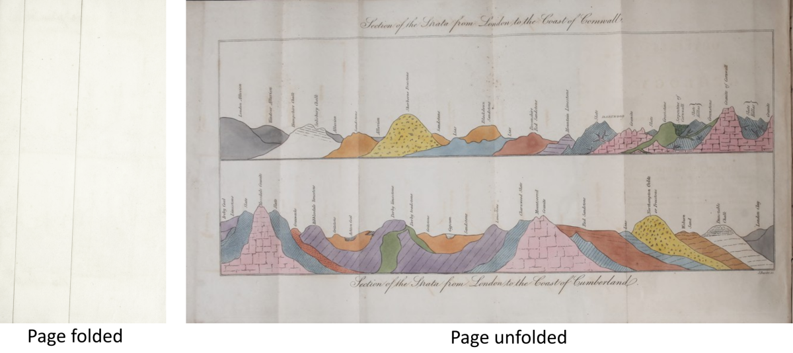

## Use Case

Books (and other objects) sometimes include foldout flaps or sheets, such as a map in a historical work. During digitization, the foldout might be captured in both its folded and unfolded state.

In the previous recipe, [Multiple choice of images in a single view][0033], a flap is offered to users as a Choice of images for the same view. But consider this example:

Here, the page has been captured folded and unfolded. Unlike the example in the previous recipe, these are not the same **view**. There is no one single IIIF Canvas that would serve to represent both of these spatial extents - we can't logically place these two images on the same spatial view.

While the present example and that given in [Multiple choice of images in a single view][0033] are clearly different, the modeling decision may not always be as obvious. There will be cases that could be modeled in either way, depending on what the publisher is trying to present.

## Implementation notes

The unfolded view is simply an additional Canvas in the sequence given by `manifest.items`.

These pages are from a printed, paged book, which might have the `behavior` value of `paged`, so as to generate the correct recto-verso-recto-verso representation in a viewer that supports this behavior. If we insert an additional Canvas into the Manifest's `items`, we will break this sequence unless we introduce an additional `behavior` property on the Canvas with the foldout using the value `non-paged` to indicate that it is not part of the paged sequence.

## Example

This example has been adapted from [https://wellcomelibrary.org/iiif/b29346423/manifest](https://wellcomelibrary.org/iiif/b29346423/manifest) but in a much reduced form to convey the essential points.

The Manifest is given the behavior `paged`. With no other qualifiers, this indicates a left-to-right sequence with the first item _recto_.

The sequence is:

* Front cover
* Inside front cover
* Foldout, folded
* Foldout, unfolded (given the behavior `non-paged`, to indicate that it does not constitute part of the paged sequence of the Manifest)
* [need to insert verso of foldout to maintain recto-verso-recto-verso following non-paged canvas]
* Title page
* _the normal run of pages would continue here; removed in this Manifest for brevity_
* Back of title page
* Inside back cover
* Back Cover





## Related recipes

* [Multiple choice of images in a single view][0033].
* [Composition of one view from multiple image sources][0036]. Care should be taken not to confuse _composition_ with the current recipe. Both involve multiple images, but composition is for building a scene from multiple images (and possibly other resources), where there is no requirement to offer the user choices _between_ those images.



